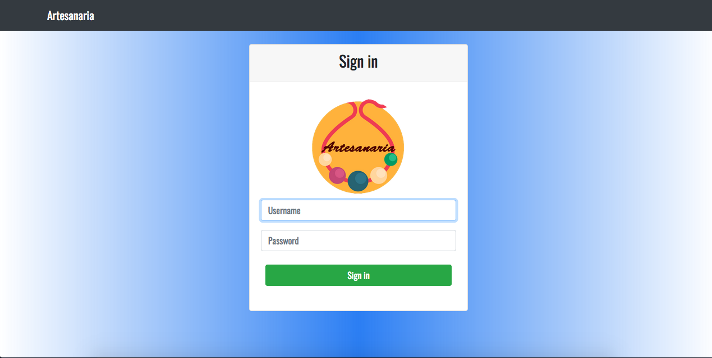
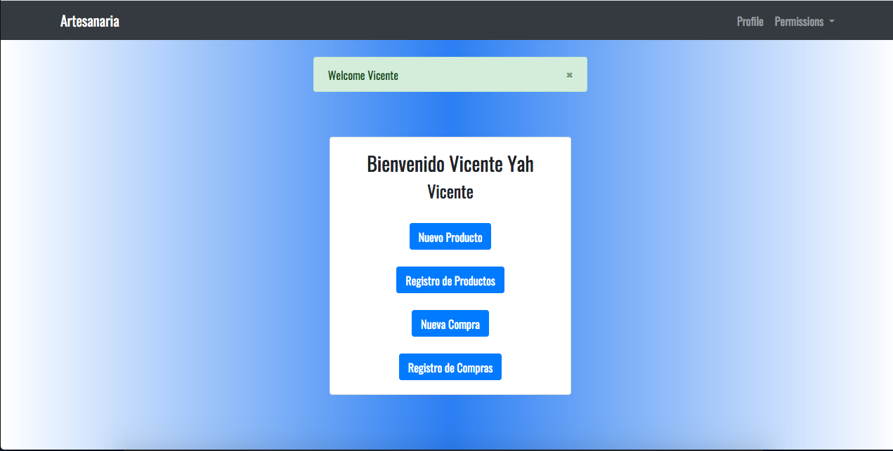

# How does it works ?
> This is a simple rest api developed in node.js, with a little database. This project was made for "Artesanaria", a company that sells handcrafts.
## Features

- Frontend handlebars engine for nodejs implemented
- User Authentication implemented
## Signin template example



## Dashboard template example


# commands to run the project
### command to install all dependencies
```bash
$ npm install
```
## command to run the rest-full api
```bash
$ npm start
```
## before you run the project, please change the password to use your database on config.js file